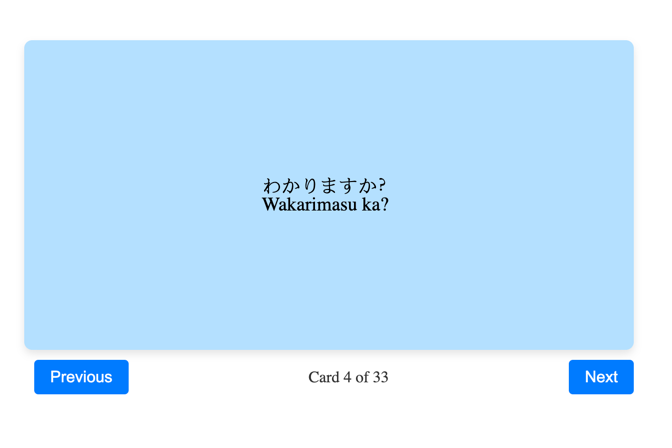

# Japanese Learning Helper

[try it out!](https://redslug.github.io/japanese-learning-helper/)

## Next Steps
- batch calls to OpenAI because they truncate the result for each file
- consider a file upload form, appending JSON data instead of overwriting it
- consider adding a tool / page for studying days / months / years
- switch to using [`pyproject.toml`](https://packaging.python.org/en/latest/guides/writing-pyproject-toml/) for backend because [PEP recommends it](https://peps.python.org/pep-0518/#specification)
