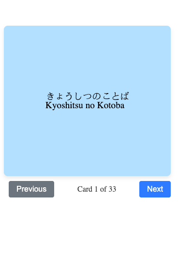

# Japanese Learning Helper

## Next Steps
- batch calls to OpenAI because they trunkate the result for each file
- consider a file upload form, appending JSON data instead of overwriting it
- consider adding a tool / page for studying days / months / years